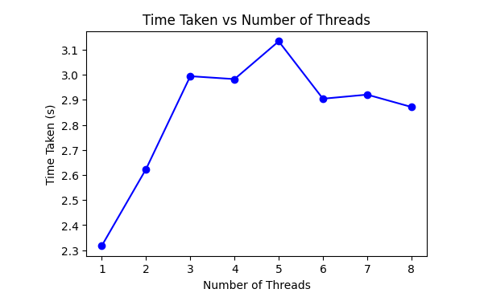

# Efficient Matrix Multiplication Benchmark

## Overview

The "Efficient Matrix Multiplication Benchmark" project aims to explore the impact of parallelization techniques, particularly multi-threading, on the performance of matrix multiplication operations. Matrix multiplication is a fundamental mathematical operation with widespread applications across various domains including mathematics, physics, engineering, and computer science. Optimizing the efficiency of matrix multiplication is crucial for enhancing computational tasks, especially in scenarios involving large-scale data processing and numerical simulations.

This project employs Python libraries such as NumPy, threading, and Pandas to conduct extensive benchmarking experiments. By generating random matrices of varying sizes and quantities, the project evaluates the effects of multi-threading on computation time and CPU utilization. The findings from these experiments provide valuable insights into the scalability and efficiency of matrix multiplication algorithms in multi-core computing environments.

## Functionalities

The project encompasses several key functionalities:

### 1. Matrix Generation

The `generate_random_matrices(num_matrices, matrix_size)` function generates random matrices of specified sizes and quantities. These matrices serve as input data for benchmarking experiments, enabling the assessment of matrix multiplication performance under different computational loads.

### 2. Matrix Multiplication

The `multiply_matrices(matrices)` function implements the core matrix multiplication algorithm. It sequentially performs matrix multiplication operations on a list of matrices, establishing a baseline for comparison with multi-threaded implementations.

### 3. Multi-Threading

The `perform_multiplication_with_threads(num_threads, matrices)` function facilitates multi-threaded matrix multiplication. By distributing the matrix multiplication task among multiple threads, this function enables parallel computation on multi-core processors. Varying the number of threads allows for the evaluation of scalability and effectiveness in optimizing matrix multiplication performance.

### 4. CPU Core Detection

The project utilizes the `multiprocessing.cpu_count()` function to detect the number of CPU cores available in the system. This information is essential for determining the maximum thread count for multi-threaded experiments, maximizing resource utilization and computational efficiency.

## Methodology

The benchmarking methodology involves several steps:

1. **Matrix Generation**: Random matrices of various sizes and quantities are generated using NumPy. These matrices serve as input data for benchmarking experiments.

2. **Benchmarking**: The project conducts benchmarking experiments to assess the performance of matrix multiplication algorithms. By varying the number of threads and observing changes in execution time, the impact of multi-threading on computation speed and efficiency is evaluated.

3. **Performance Analysis**: Benchmarking results are analyzed to gain insights into scalability and effectiveness. Performance metrics such as execution time, speedup, efficiency, and CPU utilization are computed to provide a comprehensive assessment.

## Findings

Key findings from the benchmarking experiments include:

- The influence of multi-threading on computation time and efficiency.
- The scalability of multi-threaded matrix multiplication with increasing thread counts.
- The relationship between CPU utilization and the number of threads used for computation.

## Visualizations

Visualizations aid in presenting benchmarking results effectively:

1. **Thread vs Time Taken**: Illustrates the relationship between thread count and execution time.
    

2. **CPU Usage vs Threads**: Depicts CPU utilization during matrix multiplication experiments. 
    
   
4. **Cores Utilization**: Shows CPU utilization over the course of experiments, highlighting resource utilization
   

## Conclusion

The "Efficient Matrix Multiplication Benchmark" project enhances understanding of how multi-threading influences matrix multiplication efficiency. Insights gained from comprehensive benchmarking experiments inform the design and optimization of computational tasks involving matrix calculations, leading to improved performance and efficiency in diverse applications.

## Submitted By:

- **Name:** Rohan Gulati
- **Roll Number:** 102103108
- **Group:** 3CO4
